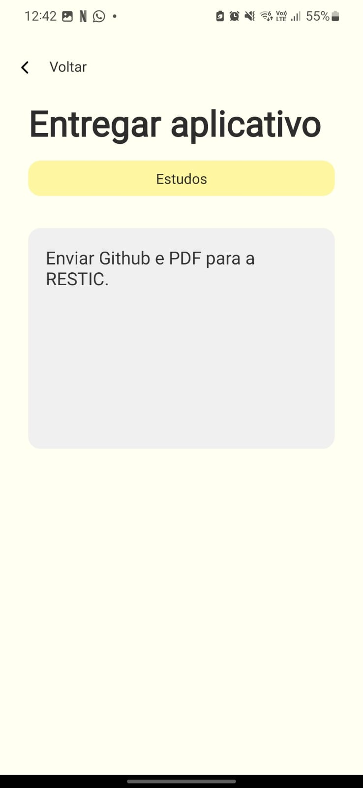
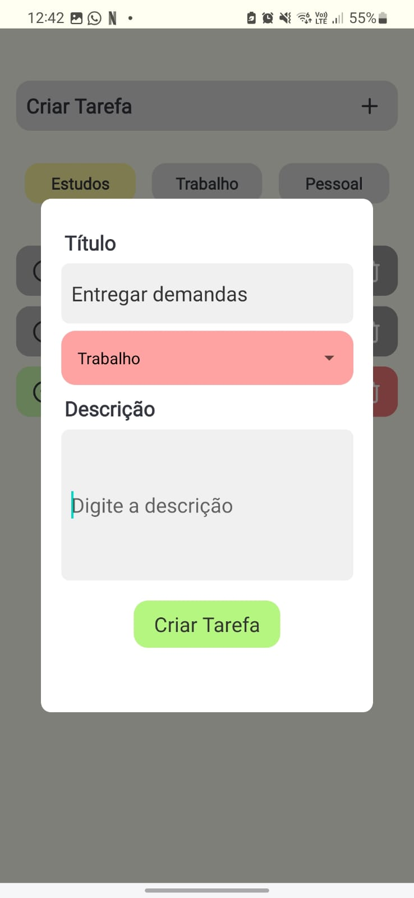
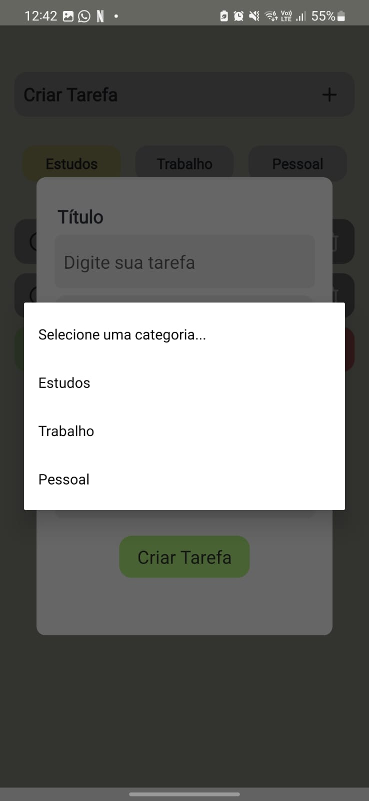
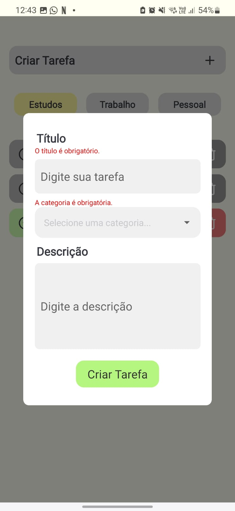

# Aplicação de Gerenciamento de Tarefas

**Desenvolvido por:** Júlia Carneiro Gonçalves de Souza  
**Links importantes:** [Figma](https://www.figma.com/design/tI7Gd8b4G4YDnAWd27U44B/Untitled?node-id=0-1&t=T1TwLZtOx59L3Vyy-1) 

## Descrição

Esta aplicação permite criar e gerenciar tarefas, categorizando-as em diferentes tipos como "Estudos", "Trabalho" e "Pessoal". Os usuários podem adicionar novas tarefas, visualizar as tarefas existentes, filtrá-las por categoria, marcar como concluídas e deletá-las.
Ela é composta por duas telas - que são navegadas com o auxílio do React Navigation. Além disso, também é utilizada a biblioteca Formik e Yup para validação de formulários. Para a persistência de dados, foi utilizado o AsyncStorage e para a estilização, o **styled-components**.

Foi desenvolvida para fins educacionais, na trilha de desenvolvimento mobile da residência de software - ResTIC36

## Funcionalidades

- **Criar tarefas:** Adiciona uma nova tarefa com título, descrição e categoria.
- **Filtrar por categoria:** Veja tarefas de uma categoria específica.
- **Marcar como concluída:** Indique se uma tarefa foi finalizada.
- **Detalhes da tarefa:** Visualize detalhes ao clicar em uma tarefa.

## Páginas da Aplicação

### 1. Home

É a página principal da aplicação. Envolve a aplicação no TaskProvider e renderiza o componente MainPage. Aqui, os estados para controle do modal e da categoria selecionada são gerenciados.

### 2. Details

Esta página é apenas para visualização dos detalhes da tarefa.

## Estrutura de Componentes

### 1. Componente MainPage

Este componente utiliza o contexto TaskContext para obter e gerenciar as tarefas. Ele renderiza a lista de tarefas com base na categoria selecionada e controla a abertura do modal para criação de novas tarefas.

### 2. Componente Cards

Este componente é um modal que permite ao usuário criar uma nova tarefa. Ele utiliza Formik para lidar com o formulário e validação de dados com o Yup. As tarefas criadas são enviadas para o contexto de tarefas.

### 3. Componente CreateTask

Este componente é um botão que, ao ser clicado, abre o modal Cards para que o usuário possa criar uma nova tarefa.

### 4. Componente TaskButtons

Este componente renderiza os botões de filtro que permitem ao usuário filtrar as tarefas com base na categoria (Estudos, Trabalho, Pessoal).

### 5. Componente Task

Este componente renderiza uma tarefa individual. Ele exibe o título, descrição e categoria da tarefa, além de mostrar o estado de conclusão da mesma. Ao ser clicado, acontece a navegação para a página Details.

## Estilização do Projeto

Toda a estilização foi feita com a biblioteca **styled-components**, onde cada componente tem sua própria página `index.tsx` e um arquivo de `styles.ts`.

## Instruções de Execução

1. Instale as dependências do projeto:
   ```bash
   npm install
   ```

2. Inicie o servidor:
   ```bash
   npm expo start
   ```

3. Para visualizar o aplicativo, instale o **Expo Go** em seu dispositivo móvel ou use um emulador Android.

*Caso tenha algum erro de execução, tente limpar reiniciar o servidor limpando o cache:
```bash
   npm expo start -c
```

---

## Conteúdo esperado

1. Páginas do projeto: 
<p align="center">
    
    
    
    
</p>

2. Modal card:
<p align="center">
    
    
    
  
</p>


## Dependências

- **@react-native-async-storage/async-storage**: Permite armazenar as tarefas do usuário de forma persistente no dispositivo, garantindo que os dados permaneçam mesmo após o fechamento do aplicativo.

- **@react-native-picker/picker** e **react-native-picker-select**: Utilizados para implementar seletores de categoria, facilitando a escolha de categorias de tarefas por parte do usuário.

- **@react-navigation/native** e **@react-navigation/native-stack**: Essas bibliotecas são responsáveis pela navegação entre as telas da aplicação, permitindo uma transição fluida entre a tela principal e a tela de detalhes da tarefa.

- **formik** e **yup**: Juntas, essas bibliotecas simplificam o gerenciamento de formulários e a validação de dados, assegurando que o usuário preencha corretamente as informações ao criar novas tarefas.

- **styled-components**: Facilita a estilização dos componentes da interface, permitindo um design mais modular e consistente ao longo da aplicação.

- **expo**: Para facilitar o desenvolvimento mobile

Essas dependências foram escolhidas para proporcionar uma interface intuitiva e funcional, melhorando a experiência do usuário ao gerenciar suas tarefas diárias.

--- 
